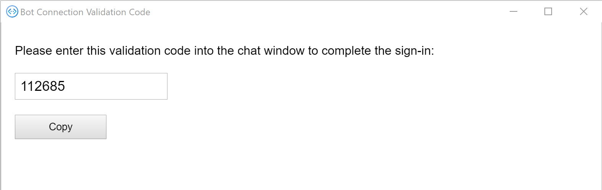

<!-- markdownlint-disable MD002 MD041 -->

<span data-ttu-id="5b406-101">在本练习中，你将使用 Bot 框架的 **OAuthPrompt** 在 Bot 中实现身份验证，并获取用于调用 MICROSOFT Graph API 的访问令牌。</span><span class="sxs-lookup"><span data-stu-id="5b406-101">In this exercise you will use the Bot Framework's **OAuthPrompt** to implement authentication in the bot, and acquire access tokens for calling the Microsoft Graph API.</span></span>

1. <span data-ttu-id="5b406-102">打开 **。/appsettings.js** ，并进行以下更改。</span><span class="sxs-lookup"><span data-stu-id="5b406-102">Open **./appsettings.json** and make the following changes.</span></span>

    - <span data-ttu-id="5b406-103">将值更改 `MicrosoftAppId` 为您的 **图形日历机器人** 应用注册的应用程序 ID。</span><span class="sxs-lookup"><span data-stu-id="5b406-103">Change the value of `MicrosoftAppId` to the application ID of your **Graph Calendar Bot** app registration.</span></span>
    - <span data-ttu-id="5b406-104">将值更改 `MicrosoftAppPassword` 为您的 **图形日历机器人** 客户端密码。</span><span class="sxs-lookup"><span data-stu-id="5b406-104">Change the value of `MicrosoftAppPassword` to your **Graph Calendar Bot** client secret.</span></span>
    - <span data-ttu-id="5b406-105">将名为的值添加为 `ConnectionName` `GraphBotAuth` 。</span><span class="sxs-lookup"><span data-stu-id="5b406-105">Add a value named `ConnectionName` with a value of `GraphBotAuth`.</span></span>

    :::code language="json" source="../demo/GraphCalendarBot/appsettings.example.json":::

    > [!NOTE]
    > <span data-ttu-id="5b406-106">如果你使用的值不是 `GraphBotAuth` Azure 门户的 **OAuth 连接设置** 中条目的名称，请使用该条目的值 `ConnectionName` 。</span><span class="sxs-lookup"><span data-stu-id="5b406-106">If you used a value other than `GraphBotAuth` for the name of your entry in **OAuth Connection Settings** in the Azure Portal, use that value for the `ConnectionName` entry.</span></span>

## <a name="implement-dialogs"></a><span data-ttu-id="5b406-107">实现对话</span><span class="sxs-lookup"><span data-stu-id="5b406-107">Implement dialogs</span></span>

1. <span data-ttu-id="5b406-108">在名为 " **对话**" 的项目的根目录中创建一个新目录。</span><span class="sxs-lookup"><span data-stu-id="5b406-108">Create a new directory in the root of the project named **Dialogs**.</span></span> <span data-ttu-id="5b406-109">在名为 **LogoutDialog.cs** 的 **/Dialogs** 目录中创建一个新文件，并添加以下代码。</span><span class="sxs-lookup"><span data-stu-id="5b406-109">Create a new file in the **./Dialogs** directory named **LogoutDialog.cs** and add the following code.</span></span>

    :::code language="csharp" source="../demo/GraphCalendarBot/Dialogs/LogoutDialog.cs" id="LogoutDialogSnippet":::

    <span data-ttu-id="5b406-110">此对话框为要从其派生的自动程序中的所有其他对话框提供基类。</span><span class="sxs-lookup"><span data-stu-id="5b406-110">This dialog provides a base class for all of the other dialogs in the bot to derive from.</span></span> <span data-ttu-id="5b406-111">这使用户可以注销，无论它们位于机器人对话框中的什么位置。</span><span class="sxs-lookup"><span data-stu-id="5b406-111">This allows the user to log out no matter where they are in the bot's dialogs.</span></span>

1. <span data-ttu-id="5b406-112">在名为 **MainDialog.cs** 的 **/Dialogs** 目录中创建一个新文件，并添加以下代码。</span><span class="sxs-lookup"><span data-stu-id="5b406-112">Create a new file in the **./Dialogs** directory named **MainDialog.cs** and add the following code.</span></span>

    ```csharp
    using System.Collections.Generic;
    using System.Threading;
    using System.Threading.Tasks;
    using Microsoft.Bot.Builder;
    using Microsoft.Bot.Builder.Dialogs;
    using Microsoft.Bot.Builder.Dialogs.Choices;
    using Microsoft.Bot.Schema;
    using Microsoft.Extensions.Configuration;
    using Microsoft.Extensions.Logging;

    namespace CalendarBot.Dialogs
    {
        public class MainDialog : LogoutDialog
        {
            const string NO_PROMPT = "no-prompt";
            protected readonly ILogger _logger;

            public MainDialog(IConfiguration configuration, ILogger<MainDialog> logger)
                : base(nameof(MainDialog), configuration["ConnectionName"])
            {
                _logger = logger;

                // OAuthPrompt dialog handles the authentication and token
                // acquisition
                AddDialog(new OAuthPrompt(
                    nameof(OAuthPrompt),
                    new OAuthPromptSettings
                    {
                        ConnectionName = ConnectionName,
                        Text = "Please login",
                        Title = "Login",
                        Timeout = 300000, // User has 5 minutes to login
                    }));

                AddDialog(new ChoicePrompt(nameof(ChoicePrompt)));

                AddDialog(new WaterfallDialog(nameof(WaterfallDialog), new WaterfallStep[]
                {
                    LoginPromptStepAsync,
                    ProcessLoginStepAsync,
                    PromptUserStepAsync,
                    CommandStepAsync,
                    ProcessStepAsync,
                    ReturnToPromptStepAsync
                }));

                // The initial child Dialog to run.
                InitialDialogId = nameof(WaterfallDialog);
            }

            private async Task<DialogTurnResult> LoginPromptStepAsync(
                WaterfallStepContext stepContext,
                CancellationToken cancellationToken)
            {
                // If we're going through the waterfall a second time, don't do an extra OAuthPrompt
                var options = stepContext.Options?.ToString();
                if (options == NO_PROMPT)
                {
                    return await stepContext.NextAsync(cancellationToken: cancellationToken);
                }

                return await stepContext.BeginDialogAsync(nameof(OAuthPrompt), null, cancellationToken);
            }

            private async Task<DialogTurnResult> ProcessLoginStepAsync(
                WaterfallStepContext stepContext,
                CancellationToken cancellationToken)
            {
                // If we're going through the waterfall a second time, don't do an extra OAuthPrompt
                var options = stepContext.Options?.ToString();
                if (options == NO_PROMPT)
                {
                    return await stepContext.NextAsync(cancellationToken: cancellationToken);
                }

                // Get the token from the previous step. If it's there, login was successful
                if (stepContext.Result != null)
                {
                    var tokenResponse = stepContext.Result as TokenResponse;
                    if (!string.IsNullOrEmpty(tokenResponse?.Token))
                    {
                        await stepContext.Context.SendActivityAsync(
                            MessageFactory.Text("You are now logged in."), cancellationToken);
                        return await stepContext.NextAsync(null, cancellationToken);
                    }
                }

                await stepContext.Context.SendActivityAsync(
                    MessageFactory.Text("Login was not successful please try again."), cancellationToken);
                return await stepContext.EndDialogAsync();
            }

            private async Task<DialogTurnResult> PromptUserStepAsync(
                WaterfallStepContext stepContext,
                CancellationToken cancellationToken)
            {
                var options = new PromptOptions
                {
                    Prompt = MessageFactory.Text("Please choose an option below"),
                    Choices = new List<Choice> {
                        new Choice { Value = "Show token" },
                        new Choice { Value = "Show me" },
                        new Choice { Value = "Show calendar" },
                        new Choice { Value = "Add event" },
                        new Choice { Value = "Log out" },
                    }
                };

                return await stepContext.PromptAsync(
                    nameof(ChoicePrompt),
                    options,
                    cancellationToken);
            }

            private async Task<DialogTurnResult> CommandStepAsync(
                WaterfallStepContext stepContext,
                CancellationToken cancellationToken)
            {
                // Save the command the user entered so we can get it back after
                // the OAuthPrompt completes
                var foundChoice = stepContext.Result as FoundChoice;
                // Result could be a FoundChoice (if user selected a choice button)
                // or a string (if user just typed something)
                stepContext.Values["command"] = foundChoice?.Value ?? stepContext.Result;

                // There is no reason to store the token locally in the bot because we can always just call
                // the OAuth prompt to get the token or get a new token if needed. The prompt completes silently
                // if the user is already signed in.
                return await stepContext.BeginDialogAsync(nameof(OAuthPrompt), null, cancellationToken);
            }

            private async Task<DialogTurnResult> ProcessStepAsync(
                WaterfallStepContext stepContext,
                CancellationToken cancellationToken)
            {
                if (stepContext.Result != null)
                {
                    var tokenResponse = stepContext.Result as TokenResponse;

                    // If we have the token use the user is authenticated so we may use it to make API calls.
                    if (tokenResponse?.Token != null)
                    {
                        var command = ((string)stepContext.Values["command"] ?? string.Empty).ToLowerInvariant();

                        if (command.StartsWith("show token"))
                        {
                            // Show the user's token - for testing and troubleshooting
                            // Generally production apps should not display access tokens
                            await stepContext.Context.SendActivityAsync(
                                MessageFactory.Text($"Your token is: {tokenResponse.Token}"),
                                cancellationToken);
                        }
                        else if (command.StartsWith("show me"))
                        {
                            await stepContext.Context.SendActivityAsync(
                                MessageFactory.Text("I don't know how to do this yet!"),
                                cancellationToken);
                        }
                        else if (command.StartsWith("show calendar"))
                        {
                            await stepContext.Context.SendActivityAsync(
                                MessageFactory.Text("I don't know how to do this yet!"),
                                cancellationToken);
                        }
                        else if (command.StartsWith("add event"))
                        {
                            await stepContext.Context.SendActivityAsync(
                                MessageFactory.Text("I don't know how to do this yet!"),
                                cancellationToken);
                        }
                        else
                        {
                            await stepContext.Context.SendActivityAsync(
                                MessageFactory.Text("I'm sorry, I didn't understand. Please try again."),
                                cancellationToken);
                        }
                    }
                }
                else
                {
                    await stepContext.Context.SendActivityAsync(
                        MessageFactory.Text("We couldn't log you in. Please try again later."),
                        cancellationToken);
                    return await stepContext.EndDialogAsync(cancellationToken: cancellationToken);
                }

                // Go to the next step
                return await stepContext.NextAsync(cancellationToken: cancellationToken);
            }

            private async Task<DialogTurnResult> ReturnToPromptStepAsync(
                WaterfallStepContext stepContext,
                CancellationToken cancellationToken)
            {
                // Restart the dialog, but skip the initial login prompt
                return await stepContext.ReplaceDialogAsync(InitialDialogId, NO_PROMPT, cancellationToken);
            }
        }
    }
    ```

    <span data-ttu-id="5b406-113">请花点时间查看此代码。</span><span class="sxs-lookup"><span data-stu-id="5b406-113">Take a moment to review this code.</span></span>

    - <span data-ttu-id="5b406-114">在构造函数中，它将设置一个 [WaterfallDialog](https://docs.microsoft.com/azure/bot-service/bot-builder-concept-waterfall-dialogs?view=azure-bot-service-4.0) ，其中包含一组按顺序发生的步骤。</span><span class="sxs-lookup"><span data-stu-id="5b406-114">In the constructor, it sets up a [WaterfallDialog](https://docs.microsoft.com/azure/bot-service/bot-builder-concept-waterfall-dialogs?view=azure-bot-service-4.0) with a set of steps that occur in order.</span></span>
        - <span data-ttu-id="5b406-115">在 `LoginPromptStepAsync` 其中发送 **OAuthPrompt**。</span><span class="sxs-lookup"><span data-stu-id="5b406-115">In `LoginPromptStepAsync` it sends an **OAuthPrompt**.</span></span> <span data-ttu-id="5b406-116">如果用户未登录，则会向用户发送 UI 提示。</span><span class="sxs-lookup"><span data-stu-id="5b406-116">If the user isn't logged in, this will send a UI prompt to the user.</span></span>
        - <span data-ttu-id="5b406-117">在 `ProcessLoginStepAsync` 该示例中检查登录是否成功，并发送一条确认消息。</span><span class="sxs-lookup"><span data-stu-id="5b406-117">In `ProcessLoginStepAsync` it checks if the login was successful and sends a confirmation.</span></span>
        - <span data-ttu-id="5b406-118">在中，将 `PromptUserStepAsync` 使用可用命令发送 **ChoicePrompt** 。</span><span class="sxs-lookup"><span data-stu-id="5b406-118">In `PromptUserStepAsync` it sends a **ChoicePrompt** with the available commands.</span></span>
        - <span data-ttu-id="5b406-119">在 `CommandStepAsync` 其中保存用户的选择，然后重新发送 **OAuthPrompt**。</span><span class="sxs-lookup"><span data-stu-id="5b406-119">In `CommandStepAsync` it saves the user's choice, then resends an **OAuthPrompt**.</span></span>
        - <span data-ttu-id="5b406-120">在 `ProcessStepAsync` 此过程中，将根据收到的命令执行操作。</span><span class="sxs-lookup"><span data-stu-id="5b406-120">In `ProcessStepAsync` it takes action based on the command received.</span></span>
        - <span data-ttu-id="5b406-121">在 `ReturnToPromptStepAsync` 该示例中，将启动瀑布，但传递一个标志以跳过初始用户登录。</span><span class="sxs-lookup"><span data-stu-id="5b406-121">In `ReturnToPromptStepAsync` it starts the waterfall over, but passes a flag to skip the initial user login.</span></span>

## <a name="update-calendarbot"></a><span data-ttu-id="5b406-122">更新 CalendarBot</span><span class="sxs-lookup"><span data-stu-id="5b406-122">Update CalendarBot</span></span>

<span data-ttu-id="5b406-123">下一步是更新 **CalendarBot** 以使用这些新对话框。</span><span class="sxs-lookup"><span data-stu-id="5b406-123">The next step is to update **CalendarBot** to use these new dialogs.</span></span>

1. <span data-ttu-id="5b406-124">打开 **/Bots/CalendarBot.cs** ，并使用以下代码替换其全部内容。</span><span class="sxs-lookup"><span data-stu-id="5b406-124">Open **./Bots/CalendarBot.cs** and replace its entire contents with the following code.</span></span>

    :::code language="csharp" source="../demo/GraphCalendarBot/Bots/CalendarBot.cs" id="CalendarBotSnippet":::

    <span data-ttu-id="5b406-125">以下是更改的简短摘要。</span><span class="sxs-lookup"><span data-stu-id="5b406-125">Here's a brief summary of the changes.</span></span>

    - <span data-ttu-id="5b406-126">将 **CalendarBot** 类更改为模板类，并接收 **对话框**。</span><span class="sxs-lookup"><span data-stu-id="5b406-126">Changed the **CalendarBot** class to be a template class, receiving a **Dialog**.</span></span>
    - <span data-ttu-id="5b406-127">将 **CalendarBot** 类更改为扩展 **TeamsActivityHandler**，使其能够在 Microsoft 团队中登录。</span><span class="sxs-lookup"><span data-stu-id="5b406-127">Changed the **CalendarBot** class to extend **TeamsActivityHandler**, allowing it to sign in in Microsoft Teams.</span></span>
    - <span data-ttu-id="5b406-128">添加了其他方法重写以启用身份验证。</span><span class="sxs-lookup"><span data-stu-id="5b406-128">Added additional method overrides to enable authentication.</span></span>

## <a name="update-startupcs"></a><span data-ttu-id="5b406-129">更新 Startup.cs</span><span class="sxs-lookup"><span data-stu-id="5b406-129">Update Startup.cs</span></span>

<span data-ttu-id="5b406-130">最后一步是更新方法， `ConfigureServices` 以添加身份验证所需的服务和新对话框。</span><span class="sxs-lookup"><span data-stu-id="5b406-130">The final step is to update the `ConfigureServices` method to add the services needed for authentication and the new dialog.</span></span>

1. <span data-ttu-id="5b406-131">打开 **./Startup.cs** 并 `services.AddTransient<IBot, Bots.CalendarBot>();` 从方法中删除该行 `ConfigureServices` 。</span><span class="sxs-lookup"><span data-stu-id="5b406-131">Open **./Startup.cs** and remove the `services.AddTransient<IBot, Bots.CalendarBot>();` line from the `ConfigureServices` method.</span></span>

1. <span data-ttu-id="5b406-132">将以下代码插入到方法的末尾 `ConfigureServices` 。</span><span class="sxs-lookup"><span data-stu-id="5b406-132">Insert the following code at the end of the `ConfigureServices` method.</span></span>

    :::code language="csharp" source="../demo/GraphCalendarBot/Startup.cs" id="ConfigureServiceSnippet":::

## <a name="test-authentication"></a><span data-ttu-id="5b406-133">测试身份验证</span><span class="sxs-lookup"><span data-stu-id="5b406-133">Test authentication</span></span>

1. <span data-ttu-id="5b406-134">保存所有更改并使用启动机器人 `dotnet run` 。</span><span class="sxs-lookup"><span data-stu-id="5b406-134">Save all of your changes and start the bot with `dotnet run`.</span></span>

1. <span data-ttu-id="5b406-135">打开 "Bot 框架" 模拟器。</span><span class="sxs-lookup"><span data-stu-id="5b406-135">Open the Bot Framework Emulator.</span></span> <span data-ttu-id="5b406-136">选择 " **文件** " 菜单，然后选择 " **新建 Bot 配置 ...**"。</span><span class="sxs-lookup"><span data-stu-id="5b406-136">Select the **File** menu, then **New Bot Configuration...**.</span></span>

1. <span data-ttu-id="5b406-137">按如下所示填写字段。</span><span class="sxs-lookup"><span data-stu-id="5b406-137">Fill in the fields as follows.</span></span>

    - <span data-ttu-id="5b406-138">**Bot 名称：**`CalendarBot`</span><span class="sxs-lookup"><span data-stu-id="5b406-138">**Bot name:** `CalendarBot`</span></span>
    - <span data-ttu-id="5b406-139">**终结点 URL：**`https://localhost:3978/api/messages`</span><span class="sxs-lookup"><span data-stu-id="5b406-139">**Endpoint URL:** `https://localhost:3978/api/messages`</span></span>
    - <span data-ttu-id="5b406-140">**Microsoft 应用程序 id：** 您的 **图形日历机器人** 应用注册的应用程序 id</span><span class="sxs-lookup"><span data-stu-id="5b406-140">**Microsoft App ID:** the application ID of your **Graph Calendar Bot** app registration</span></span>
    - <span data-ttu-id="5b406-141">**Microsoft 应用密码：** 您的 **图形日历机器人** 客户端密码</span><span class="sxs-lookup"><span data-stu-id="5b406-141">**Microsoft App password:** your **Graph Calendar Bot** client secret</span></span>
    - <span data-ttu-id="5b406-142">**加密存储在你的 bot 配置中的密钥：** 了</span><span class="sxs-lookup"><span data-stu-id="5b406-142">**Encrypt keys stored in your bot configuration:** Enabled</span></span>

    

1. <span data-ttu-id="5b406-144">选择 " **保存并连接**"。</span><span class="sxs-lookup"><span data-stu-id="5b406-144">Select **Save and connect**.</span></span> <span data-ttu-id="5b406-145">在仿真程序连接之后，您应该会看到 `Welcome to Microsoft Graph CalendarBot. Type anything to get started.`</span><span class="sxs-lookup"><span data-stu-id="5b406-145">After the emulator connects, you should see `Welcome to Microsoft Graph CalendarBot. Type anything to get started.`</span></span>

1. <span data-ttu-id="5b406-146">键入一些文本并将其发送到机器人。</span><span class="sxs-lookup"><span data-stu-id="5b406-146">Type some text and send it to the bot.</span></span> <span data-ttu-id="5b406-147">机器人将使用登录提示进行响应。</span><span class="sxs-lookup"><span data-stu-id="5b406-147">The bot responds with a login prompt.</span></span>

1. <span data-ttu-id="5b406-148">选择 " **登录** " 按钮。</span><span class="sxs-lookup"><span data-stu-id="5b406-148">Select the **Login** button.</span></span> <span data-ttu-id="5b406-149">仿真程序将提示您确认以开头的 URL `oauthlink://https://token.botframeworkcom` 。</span><span class="sxs-lookup"><span data-stu-id="5b406-149">The emulator prompts you to confirm the URL that starts with `oauthlink://https://token.botframeworkcom`.</span></span> <span data-ttu-id="5b406-150">选择 " **确认** " 以继续。</span><span class="sxs-lookup"><span data-stu-id="5b406-150">Select **Confirm** to continue.</span></span>

1. <span data-ttu-id="5b406-151">在弹出窗口中，使用 Microsoft 365 帐户登录。</span><span class="sxs-lookup"><span data-stu-id="5b406-151">In the pop-up window, login with your Microsoft 365 account.</span></span> <span data-ttu-id="5b406-152">查看请求的权限并接受。</span><span class="sxs-lookup"><span data-stu-id="5b406-152">Review the requested permissions and accept.</span></span>

1. <span data-ttu-id="5b406-153">完成身份验证和同意后，弹出窗口将提供验证代码。</span><span class="sxs-lookup"><span data-stu-id="5b406-153">Once authentication and consent are complete, the pop-up window provides a validation code.</span></span> <span data-ttu-id="5b406-154">复制代码并关闭窗口。</span><span class="sxs-lookup"><span data-stu-id="5b406-154">Copy the code and close the window.</span></span>

    

1. <span data-ttu-id="5b406-156">在聊天窗口中输入验证代码，以完成登录。</span><span class="sxs-lookup"><span data-stu-id="5b406-156">Enter the validation code in the chat window to complete the login.</span></span>

    

1. <span data-ttu-id="5b406-158">如果选择 " **显示令牌** " 按钮 (或键入 `show token`) ，则 bot 将显示访问令牌。</span><span class="sxs-lookup"><span data-stu-id="5b406-158">If you select the **Show token** button (or type `show token`), the bot displays the access token.</span></span> <span data-ttu-id="5b406-159"> (或键入) 的 " **注销** " 按钮 `log out` 将注销。</span><span class="sxs-lookup"><span data-stu-id="5b406-159">The **Log out** button (or typing `log out`) will log you out.</span></span>

> [!TIP]
> <span data-ttu-id="5b406-160">在使用 bot 启动对话时，您可能会在 Bot 框架仿真器中收到以下错误消息。</span><span class="sxs-lookup"><span data-stu-id="5b406-160">You may receive the following error message in the Bot Framework Emulator when starting a conversation with the bot.</span></span>
>
> ```text
> Failed to generate an actual sign-in link: Error: Failed to connect to ngrok instance for OAuth postback URL:
> FetchError: request to http://127.0.0.1:4041/api/tunnels failed, reason: connect ECONNREFUSED 127.0.0.1:4041
> ```
>
> <span data-ttu-id="5b406-161">如果发生这种情况，请关闭仿真程序并重新启动它。</span><span class="sxs-lookup"><span data-stu-id="5b406-161">If this happens, close the emulator and restart it.</span></span>
